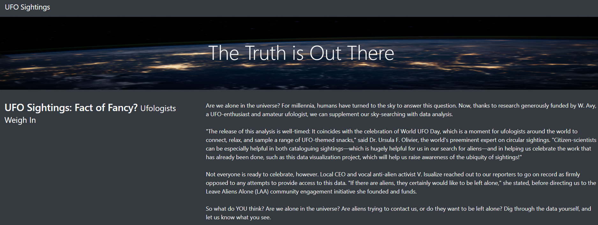
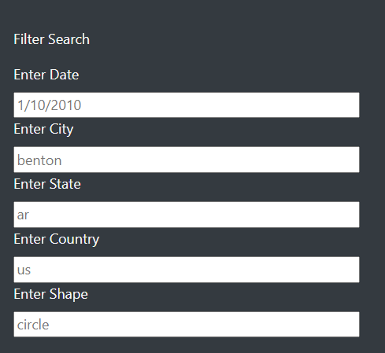
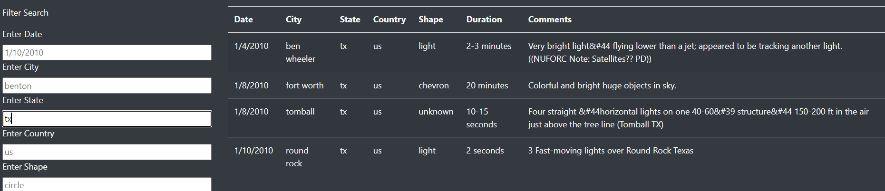

# UFO's
A data journalist, Dana is interested in writing about sightings, she found McMinnville, Oregon the perfect place to do it because is famous for its sightings and even has an annual gathering of UFO enthusiasts.

## Overview of Project 
### Purpose
The purpose of this project is to show a visual funtionality information into a HTML page, manipulated by JavaScript and possible to filter and read the information according to parameters. The parameters are date, countries, cities, states and type of sighting (shape). 

## Results 

The first part of the webpage is an amazing background, a main title, a second title and an introduction of the Dana's new.

Second, below to the introduction there is a complete table that has all the information that Dana have founded, this table includes the date of sighting, the city, the state, the country, the shape, the duratioon of sighting and the comments. 

Up to this point, we found a static webpage.

On the left side, there is a filter search column that helps all Dana's readers to find a specific information, according to different parameters, dates, country, city, state, or shape. It is programmed with only one filter, that is you can write only the date or another parameter like city and the table will give you that specific information. 

Using this code: 

           Object.entries(filters).forEach(([key, value]) => {
            filteredData = filteredData.filter(row => row[key] === value);
             });

The value wrote into the parameters options,  loop through all of the filters and keep any data that
 matches the filter values.

 

 In this case, I wrote "tx" (that means Texas) in "Enter State" into the Filter Search Column, and as we see the table filtered the data that match with this parameter. We got 4 results. There are different dates, different cities, same country because tx is in US, differnet shapes different duration and different comments. Only the state and country are the same in the four results.

### Summary

Finally, a drawback is that if someone wants to read a different sighting, have to delete it manually and then write the new parameter, and so on. So in this case, will be better if we add a delete button, that deletes the parameter already written just in one step. In this case, is possible if we add a button on the HTML code and relate it with a function in the app.py code that deletes the parameters with the table filter. 
